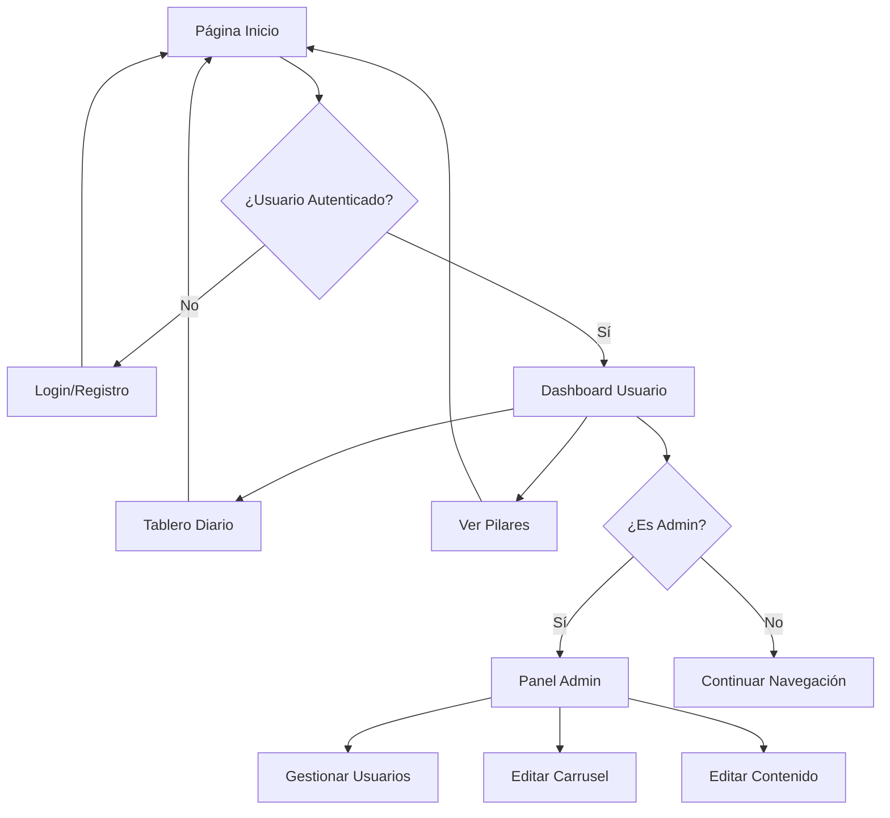

## 1. Product Overview
Aplicación web para la gestión logística de CD Riohacha que permite el control y monitoreo de operaciones logísticas mediante un tablero diario interactivo y carrusel de contenido administrable.

La plataforma permite a los usuarios acceder a información clave sobre KPIs logísticos, visualizar contenido multimedia informativo, y a los administradores gestionar usuarios y contenido dinámico.

## 2. Core Features

### 2.1 User Roles
| Role | Registration Method | Core Permissions |
|------|---------------------|------------------|
| Usuario Regular | Registro por email | Ver carrusel, acceder a secciones informativas, ver tablero diario |
| Administrador | Asignación por admin existente | Gestionar usuarios, editar carrusel, modificar contenido de secciones, acceso total |

### 2.2 Feature Module
La aplicación CD Riohacha consta de las siguientes páginas principales:
1. **Página de Inicio**: carrusel con imágenes/videos, sección Nosotros, códigos QR, pilares logísticos
2. **Login/Registro**: formularios de autenticación y creación de cuentas
3. **Tablero Diario**: visualización de KPIs logísticos con datos diarios
4. **Panel de Administración**: gestión de usuarios, carrusel, y contenido de secciones
5. **Página Pilares**: información detallada de cada pilar logístico (Flota, Warehouse, People, Seguridad, Reparto)

### 2.3 Page Details
| Page Name | Module Name | Feature description |
|-----------|-------------|---------------------|
| Página de Inicio | Carrusel Principal | Mostrar imágenes/videos en loop automático con controles de navegación y puntos indicadores |
| Página de Inicio | Sección Nosotros | Mostrar descripción de la empresa con imagen y botón "Conocer más" |
| Página de Inicio | Códigos QR | Mostrar tarjetas con información de contacto y códigos QR para Sedial y SLA |
| Página de Inicio | Nuestros Pilares | Mostrar grid de iconos con los 5 pilares logísticos clickeables |
| Login/Registro | Formulario Login | Permitir ingreso con email/contraseña, recuperación de contraseña, login social Google/Microsoft |
| Login/Registro | Formulario Registro | Crear nueva cuenta con validación de datos y asignación de rol |
| Tablero Diario | Tabla KPIs | Mostrar tabla con indicadores logísticos, valores MTD, y datos diarios con codificación de colores |
| Tablero Diario | Filtros y Exportación | Permitir filtrar datos y descargar reportes en formato exportable |
| Panel Admin | Gestión Usuarios | Listar usuarios, agregar nuevos, editar roles, eliminar cuentas, búsqueda y filtrado |
| Panel Admin | Gestión Carrusel | Subir/editar/eliminar imágenes y videos del carrusel principal |
| Panel Admin | Editor Contenido | Modificar texto e imágenes de secciones informativas mediante editor WYSIWYG |
| Panel Admin | Gestión Pilares | Editar contenido de cada pilar logístico con texto descriptivo e imágenes |

## 3. Core Process

### Flujo Usuario Regular:
1. Usuario accede a la página principal
2. Visualiza carrusel con contenido logístico
3. Navega por secciones informativas (Nosotros, Pilares)
4. Accede a Tablero Diario para ver KPIs
5. Puede descargar reportes si tiene permisos

### Flujo Administrador:
1. Admin inicia sesión con credenciales
2. Accede al Panel de Administración
3. Gestiona usuarios (crear, editar, eliminar)
4. Actualiza contenido del carrusel
5. Modifica texto de secciones informativas
6. Actualiza información de pilares logísticos

## 4. User Interface Design

### 4.1 Design Style
- **Colores Primarios**: Azul profundo (#1e3a8a), Azul medio (#3b82f6), Blanco (#ffffff)
- **Colores Secundarios**: Gris claro (#f3f4f6), Dorado (#f59e0b) para acentos
- **Estilo Botones**: Rectángulos redondeados, primarios en azul sólido con texto blanco, secundarios con borde azul
- **Tipografía**: Sans-serif moderna (Inter/Roboto), tamaños 14-16px para texto, 18-24px para títulos
- **Layout**: Basado en tarjetas con sombras sutiles, navegación superior fija
- **Iconos**: Estilo outline consistente, azul para activos, gris para inactivos

### 4.2 Page Design Overview
| Page Name | Module Name | UI Elements |
|-----------|-------------|-------------|
| Página Inicio | Carrusel | Imágenes de 1200x600px, overlay oscuro 50%, texto blanco centrado, controles de navegación laterales |
| Página Inicio | Tarjetas Info | Diseño grid responsive, bordes redondeados 8px, sombra 0 2px 4px rgba(0,0,0,0.1), padding 24px |
| Login | Formulario | Inputs de 320px ancho, botones primarios de 48px altura, validación visual con bordes coloridos |
| Tablero Diario | Tabla | Headers azules con texto blanco, filas alternadas gris claro, badges color-coded (verde/rojo/azul) |
| Panel Admin | Sidebar | Ancho 250px, gradiente azul oscuro a medio, texto blanco, iconos 20px, espaciado 16px |
| Panel Admin | Tablas | Headers con fondo gris claro, acciones con botones pequeños (editar azul, eliminar rojo) |

### 4.3 Responsiveness
- Diseño desktop-first con adaptación mobile
- Breakpoints: 1200px (desktop), 768px (tablet), 480px (móvil)
- Menú hamburger para móviles, carrusel adaptativo, tablas scrollables horizontalmente
- Optimización táctil con botones mínimos 44x44px