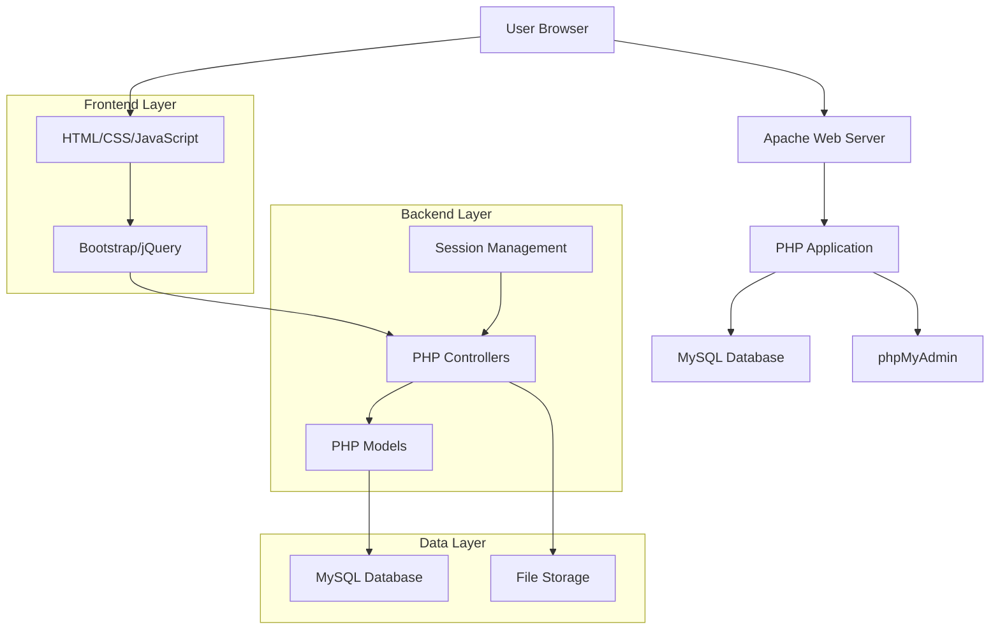
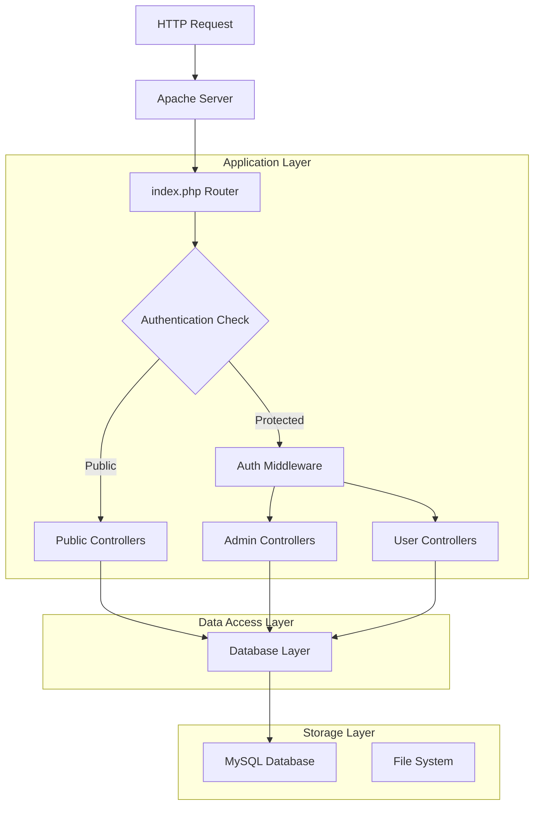
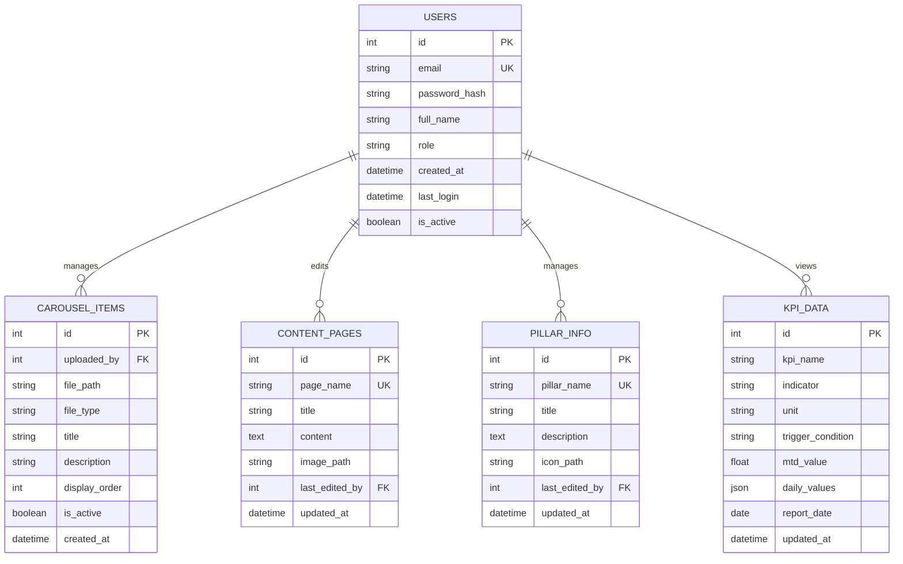

## 1. Architecture design



## 2. Technology Description
- **Frontend**: HTML5, CSS3, JavaScript ES6, Bootstrap 5, jQuery 3.6
- **Backend**: PHP 8.1+, MVC Pattern
- **Database**: MySQL 8.0+, phpMyAdmin para administración
- **Web Server**: Apache 2.4+
- **Version Control**: Git con repositorio local y remoto
- **File Storage**: Sistema de archivos local para imágenes/videos del carrusel

## 3. Route definitions
| Route | Purpose |
|-------|---------|
| /index.php | Página principal con carrusel y secciones informativas |
| /login.php | Formulario de inicio de sesión |
| /register.php | Formulario de registro de nuevos usuarios |
| /dashboard.php | Tablero diario con KPIs logísticos |
| /admin/ | Panel de administración (requiere autenticación admin) |
| /admin/users.php | Gestión de usuarios |
| /admin/carousel.php | Gestión de contenido del carrusel |
| /admin/content.php | Editor de contenido de secciones |
| /admin/pillars.php | Gestión de información de pilares |
| /logout.php | Cierre de sesión |

## 4. API definitions

### 4.1 Authentication API
```
POST /api/auth/login.php
```

Request:
| Param Name | Param Type | isRequired | Description |
|------------|------------|------------|-------------|
| email | string | true | Correo electrónico del usuario |
| password | string | true | Contraseña del usuario |

Response:
| Param Name | Param Type | Description |
|------------|------------|-------------|
| success | boolean | Estado de la autenticación |
| message | string | Mensaje de respuesta |
| user_data | object | Datos del usuario (si exitoso) |

### 4.2 User Management API
```
POST /api/users/create.php
GET /api/users/list.php
PUT /api/users/update.php
DELETE /api/users/delete.php
```

### 4.3 Carousel Management API
```
POST /api/carousel/upload.php
GET /api/carousel/list.php
PUT /api/carousel/update.php
DELETE /api/carousel/delete.php
```

## 5. Server architecture diagram



## 6. Data model

### 6.1 Data model definition


### 6.2 Data Definition Language

**Tabla de Usuarios (users)**
```sql
CREATE TABLE users (
    id INT PRIMARY KEY AUTO_INCREMENT,
    email VARCHAR(255) UNIQUE NOT NULL,
    password_hash VARCHAR(255) NOT NULL,
    full_name VARCHAR(100) NOT NULL,
    role ENUM('admin', 'user') DEFAULT 'user',
    is_active BOOLEAN DEFAULT TRUE,
    created_at TIMESTAMP DEFAULT CURRENT_TIMESTAMP,
    last_login TIMESTAMP NULL,
    INDEX idx_email (email),
    INDEX idx_role (role)
);

-- Insertar usuario admin inicial
INSERT INTO users (email, password_hash, full_name, role) 
VALUES ('admin@cdriohacha.com', '$2y$10$92IXUNpkjO0rOQ5byMi.Ye4oKoEa3Ro9llC/.og/at2.uheWG/igi', 'Administrador CD Riohacha', 'admin');
```

**Tabla de Carrusel (carousel_items)**
```sql
CREATE TABLE carousel_items (
    id INT PRIMARY KEY AUTO_INCREMENT,
    uploaded_by INT NOT NULL,
    file_path VARCHAR(500) NOT NULL,
    file_type ENUM('image', 'video') DEFAULT 'image',
    title VARCHAR(200),
    description TEXT,
    display_order INT DEFAULT 0,
    is_active BOOLEAN DEFAULT TRUE,
    created_at TIMESTAMP DEFAULT CURRENT_TIMESTAMP,
    FOREIGN KEY (uploaded_by) REFERENCES users(id) ON DELETE CASCADE,
    INDEX idx_active_order (is_active, display_order)
);
```

**Tabla de Contenido (content_pages)**
```sql
CREATE TABLE content_pages (
    id INT PRIMARY KEY AUTO_INCREMENT,
    page_name VARCHAR(50) UNIQUE NOT NULL,
    title VARCHAR(200),
    content TEXT,
    image_path VARCHAR(500),
    last_edited_by INT NOT NULL,
    updated_at TIMESTAMP DEFAULT CURRENT_TIMESTAMP ON UPDATE CURRENT_TIMESTAMP,
    FOREIGN KEY (last_edited_by) REFERENCES users(id) ON DELETE CASCADE
);

-- Insertar páginas iniciales
INSERT INTO content_pages (page_name, title, content, last_edited_by) VALUES
('nosotros', 'Nosotros', 'Soluciones logísticas integrales para mejorar la eficiencia de tu operación. Monitorea, analiza y optimiza procesos clave para una gestión logística más ágil y efectiva.', 1),
('pilares', 'Nuestros Pilares', 'Conoce nuestros pilares fundamentales que garantizan una operación logística eficiente y segura.', 1);
```

**Tabla de KPIs (kpi_data)**
```sql
CREATE TABLE kpi_data (
    id INT PRIMARY KEY AUTO_INCREMENT,
    kpi_name VARCHAR(100) NOT NULL,
    indicator VARCHAR(100),
    unit VARCHAR(20),
    trigger_condition VARCHAR(50),
    mtd_value DECIMAL(10,2),
    daily_values JSON,
    report_date DATE NOT NULL,
    updated_at TIMESTAMP DEFAULT CURRENT_TIMESTAMP ON UPDATE CURRENT_TIMESTAMP,
    INDEX idx_kpi_date (kpi_name, report_date)
);
```